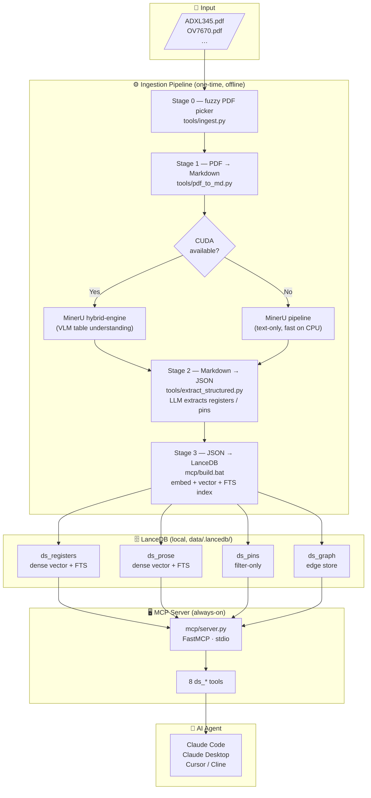
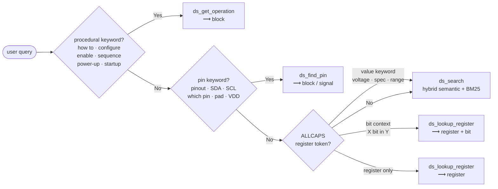
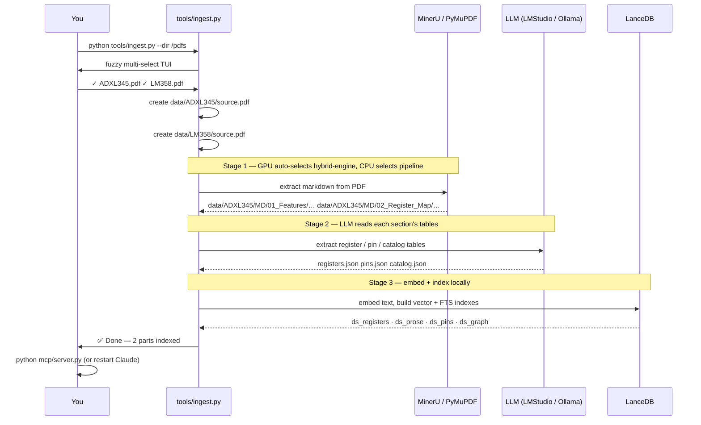

# Datasheet MCP

> Query component datasheets with an AI agent — registers, pins, operating procedures, and dependency graphs, all locally indexed.


---

## Overview

**Datasheet MCP** indexes component datasheet PDFs into a local vector database and exposes them to AI agents (Claude Code, Claude Desktop, Cursor, Cline) via the Model Context Protocol. An agent can look up register definitions, bit fields, pin assignments, operating procedures, and cross-component dependency graphs — all with hybrid semantic + keyword search.

Everything runs **100 % locally** — no Qdrant server, no cloud API required for the MCP server itself. Pre-indexed parts: **ADXL345** (Analog Devices accelerometer), **OV7670** (OmniVision camera), **MX25LM51245G** (Macronix flash), **SV032M8DALL** (7-segment display).

---

## System Architecture



---

## MCP Tools

Use **`ds_auto`** as the primary entry point — it routes to the correct backend automatically. Only call specialist tools when you already know which one is needed.

| Tool | Use when… | Auto-route trigger |
|---|---|---|
| `ds_auto` | **Always start here** — single entry point | any query |
| `ds_search` | Supply voltage, bandwidth, feature overview, spec tables | default fallback |
| `ds_lookup_register` | User names a register symbol (`POWER_CTL`) or a bit (`MEASURE bit`) | ALLCAPS token |
| `ds_get_operation` | Initialization sequence, power-up procedure, configuration steps | "how to", "configure", "enable", "sequence" |
| `ds_find_pin` | Pinout, pad assignments, which pin is SDA / CS | "pinout", "SDA", "which pin", "pad" |
| `ds_neighbors` | Register / block dependency graph, what enables what | node path |
| `ds_list_parts` | User explicitly asks which datasheets are indexed | explicit ask only |
| `ds_list_blocks` | User explicitly asks which blocks a part has | explicit ask only |

> **Global rule:** Use exactly **one** tool per query. Do NOT chain `ds_search` + `ds_lookup_register` for the same question.

### Query routing inside `ds_auto`



---

## Prerequisites

| Requirement | Purpose | Notes |
|---|---|---|
| Python ≥ 3.11 | Runtime | 3.12 recommended |
| `pip install -r mcp/requirements.txt` | All Python deps (LanceDB, FastMCP, …) | See `mcp/requirements.txt` |
| [MinerU](https://github.com/opendatalab/MinerU) — `pip install mineru` | Stage 1 PDF extraction (best quality) | **Optional** — PyMuPDF fallback included |
| LMStudio, Ollama, or OpenAI | Stage 2 LLM extraction | Load any instruction model (e.g. `qwen3:14b`) |
| `pip install InquirerPy` | Fuzzy TUI multi-select | **Optional** — numbered menu fallback included |

---

## Local Install

```bash
# 1. Enter the project directory
cd 08_datasheetMCP

# 2. Install Python dependencies
pip install -r mcp/requirements.txt

# 3. Copy and edit configuration
cp mcp/.env.example mcp/.env
# Open mcp/.env and set:
#   EXTRACT_LLM_BACKEND = lmstudio | ollama | openai
#   EXTRACT_LLM_HOST    = http://localhost:1234/v1   (LMStudio default)
#   EXTRACT_LLM_MODEL   = qwen3:14b                  (or your model)

# 4. (Optional) faster fuzzy PDF selection
pip install InquirerPy

# 5. Verify the MCP server starts
python mcp/server.py
# Expected: server starts silently, waiting for stdio input
# Kill with Ctrl+C
```

### Register with your AI client

**Claude Code** — add to `.mcp.json` in your project root:

```json
{
  "mcpServers": {
    "ds": {
      "command": "python",
      "args": ["C:/absolute/path/to/08_datasheetMCP/mcp/server.py"]
    }
  }
}
```

**Claude Desktop** — edit `%APPDATA%\Claude\claude_desktop_config.json` (Windows) or `~/Library/Application Support/Claude/claude_desktop_config.json` (macOS):

```json
{
  "mcpServers": {
    "ds": {
      "command": "python",
      "args": ["/absolute/path/to/08_datasheetMCP/mcp/server.py"]
    }
  }
}
```

**Cursor / Cline** — Settings → MCP Servers → Add Server:
- Command: `python`
- Args: `/absolute/path/to/08_datasheetMCP/mcp/server.py`

---

## Adding a New Datasheet

### Method A — Unified ingest CLI (recommended)

```bash
# Scan a folder, pick PDFs interactively, run all stages automatically:
python tools/ingest.py --dir /path/to/pdf/folder

# Or ingest a single file directly:
python tools/ingest.py --pdf /downloads/LM358.pdf

# Options:
python tools/ingest.py --no-extract      # skip LLM extraction (use cached registers.json)
python tools/ingest.py --no-prose        # skip prose index (registers + pins only)
python tools/ingest.py --no-graph        # skip dependency graph
python tools/ingest.py --reset           # drop existing LanceDB tables first
python tools/ingest.py --backend pymupdf # use PyMuPDF instead of MinerU (no GPU needed)
```

### What happens under the hood



### Method B — Manual stage-by-stage

```bash
# Stage 1: PDF → chapter markdown
#   GPU machine: hybrid-engine (VLM understands table structure)
#   CPU laptop:  pipeline (text-only, auto-selected, fast)
python tools/pdf_to_md.py --pdf /downloads/ADXL345.pdf
# Creates: data/ADXL345/source.pdf  +  data/ADXL345/MD/NN_Section/…

# Stage 2: LLM extraction (fully resumable — cached per section)
python tools/extract_structured.py --part ADXL345
# Creates: data/ADXL345/registers.json  pins.json  catalog.json
#          data/ADXL345/.extract_cache.json  (resume cache)

# Stage 3: Embed + index
cd mcp
build.bat --part ADXL345           # Windows
bash build.sh --part ADXL345       # Linux / macOS

# Re-index after switching embedding model:
build.bat --part ADXL345 --reset
```

### Data layout after ingestion

```
data/
├── .lancedb/               ← LanceDB vector store (auto-created)
│   ├── ds_registers.lance
│   ├── ds_prose.lance
│   ├── ds_pins.lance
│   └── ds_graph.lance
└── ADXL345/
    ├── source.pdf          ← original PDF (copied here automatically)
    ├── MD/                 ← MinerU markdown output
    │   ├── 01_Features/01_Features.md
    │   ├── 02_Register_Map/02_Register_Map.md
    │   └── …
    ├── registers.json      ← extracted register cards
    ├── pins.json           ← extracted pin table
    ├── catalog.json        ← vendor / title / revision
    └── .extract_cache.json ← resumable LLM extraction cache
```

---

## Testing with CLI

### Option A — MCP Inspector (interactive browser UI)

```bash
# Requires Node.js
npx @modelcontextprotocol/inspector python mcp/server.py
# Opens http://localhost:5173  →  shows all 8 tools, call them interactively
```

### Option B — Claude Code (recommended)

After registering `.mcp.json`, open Claude Code and try:

```
# Natural language — ds_auto routes automatically:
What is the POWER_CTL register in the ADXL345?
How do I configure the FIFO on the ADXL345?
Which pin is SDA on the ADXL345?
What is the supply voltage range of the ADXL345?

# Explicit tool calls:
ds_list_parts()
ds_list_blocks("ADXL345")
ds_lookup_register("ADXL345", "POWER_CTL")
ds_lookup_register("ADXL345", "POWER_CTL", bit="MEASURE")
ds_get_operation("ADXL345", "FIFO")
ds_find_pin("ADXL345")
ds_neighbors("ADXL345", "FIFO", depth=2)
ds_search("ADXL345", "output data rate bandwidth")
```

### Option C — Unit tests (no LLM or DB needed)

```bash
python -m pytest tests/ -v
# 160 tests, ~0.4 s — covers model, cards, router, tokens, catalog, prose, graph
```

---

## Configuration Reference

Edit `mcp/.env` to override any setting. Copy from `mcp/.env.example` to start.

| Variable | Default | Purpose |
|---|---|---|
| `DS_DB_PATH` | `data/.lancedb` | LanceDB storage directory (relative to repo root) |
| `DS_EMBED_MODEL` | `BAAI/bge-small-en-v1.5` | Sentence-transformers model name (384-dim, CPU-friendly) |
| `DS_EMBED_DEVICE` | auto (`cuda` → `cpu`) | Embedding device override |
| `DS_EMBED_BATCH_SIZE` | 256 (GPU) / 32 (CPU) | Embedding batch size — reduce to 16 on low-RAM CPUs |
| `DS_RERANKER_MODEL` | *(unset)* | Optional cross-encoder, e.g. `cross-encoder/ms-marco-MiniLM-L-6-v2` |
| `DS_TRANSPORT` | `stdio` | MCP transport: `stdio` / `streamable-http` / `sse` |
| `DS_HOST` | `0.0.0.0` | Host for HTTP transport |
| `DS_PORT` | `8002` | Port for HTTP transport |
| `DS_API_KEYS` | *(unset)* | Comma-separated bearer tokens for HTTP mode |
| `EXTRACT_LLM_BACKEND` | `lmstudio` | LLM for Stage 2: `lmstudio` / `ollama` / `openai` |
| `EXTRACT_LLM_HOST` | `http://localhost:1234/v1` | LLM API endpoint |
| `EXTRACT_LLM_MODEL` | `qwen3:14b` | Model loaded in LMStudio / Ollama |
| `EXTRACT_LLM_KEY` | `lm-studio` | API key (`lm-studio` / `ollama` for local; real key for OpenAI) |
| `EXTRACT_WORKERS` | `4` | Parallel LLM extraction workers per part |
| `MINERU_DEVICE_MODE` | auto | MinerU device override: `cuda` / `cpu` |

### Embedding model options

| Model | Dim | Size | Best for |
|---|---|---|---|
| `BAAI/bge-small-en-v1.5` **(default)** | 384 | ~130 MB | CPU laptop |
| `BAAI/bge-base-en-v1.5` | 768 | ~440 MB | CPU with more RAM |
| `BAAI/bge-large-en-v1.5` | 1024 | ~1.3 GB | GPU recommended |

> After changing `DS_EMBED_MODEL`, re-run `build.bat --part <P> --reset` to rebuild the vector index with the new dimensions.

---

## LanceDB Tables

| Table | Vectors | FTS columns | Key payload | Used by |
|---|---|---|---|---|
| `ds_registers` | dense 384-dim | `register`, `name` | vendor, part, block, register, bitfields (JSON), addresses (JSON), notes | `ds_lookup_register`, `ds_search` |
| `ds_prose` | dense 384-dim | `text`, `heading`, `breadcrumb` | part, block, section, heading, is_operation (bool) | `ds_search`, `ds_get_operation` |
| `ds_pins` | none | none | part, block, pin, signal, type, description | `ds_find_pin` |
| `ds_graph` | none | none | part, edge_type, source_id, target_id, label, weight | `ds_neighbors` |

**Hybrid search**: dense vector (70 %) + BM25 full-text (30 %) fused by `LinearCombinationReranker`. Optional `DS_RERANKER_MODEL` cross-encoder reranks the top candidates.

---

## Project Structure

```
08_datasheetMCP/
├── .mcp.json                  ← Claude Code MCP registration
├── README.md
├── data/
│   ├── .lancedb/              ← LanceDB vector store (auto-created)
│   ├── ADXL345/source.pdf
│   └── OV7670/source.pdf  …
├── mcp/
│   ├── server.py              ← MCP server entrypoint
│   ├── build.bat / build.sh   ← Stage 3 build scripts
│   ├── build_helper.py
│   ├── requirements.txt
│   ├── .env / .env.example
│   └── ds/                    ← main Python package
│       ├── mcp_server.py      ← FastMCP tool definitions (8 tools)
│       ├── query.py           ← DS facade (lookup / search / auto)
│       ├── router.py          ← regex query classifier
│       ├── model.py           ← RegisterCard, Pin, ProseBlock, …
│       ├── embed.py           ← GPU/CPU adaptive embedder
│       ├── db.py              ← LanceDB connection singleton
│       ├── catalog.py         ← part/section discovery
│       ├── cards.py           ← register card renderer
│       ├── tokens.py          ← token budgeting
│       ├── reranker.py        ← cross-encoder (optional)
│       ├── index/             ← LanceDB table wrappers
│       │   ├── registers.py
│       │   ├── prose.py
│       │   └── pins.py
│       ├── ingest/            ← ingestion pipeline
│       │   ├── extract.py     ← LLM extraction (registers/pins)
│       │   ├── prose.py       ← markdown → ProseBlock
│       │   └── build.py       ← JSON → LanceDB orchestrator
│       └── graph/             ← dependency graph
│           ├── model.py
│           ├── store.py
│           ├── build.py
│           └── query.py
├── tools/
│   ├── ingest.py              ← unified CLI (fuzzy pick + all stages)
│   ├── pdf_to_md.py           ← Stage 1: PDF → Markdown
│   └── extract_structured.py  ← Stage 2: Markdown → JSON
└── tests/                     ← 160 unit tests (no DB/LLM needed)
    ├── conftest.py
    └── test_*.py
```

---

## Troubleshooting

| Symptom | Likely cause | Fix |
|---|---|---|
| `ds_list_parts()` returns empty | Parts not indexed yet | Run `python tools/ingest.py` |
| `MinerU not found` | Not installed | `pip install mineru` or use `--backend pymupdf` |
| `Cannot reach lmstudio at …` | LMStudio not running or wrong port | Start LMStudio, load a model, enable local server |
| `dim mismatch — recreating collection` | `DS_EMBED_MODEL` changed since last index | Expected — tables are auto-recreated with the new dim |
| No hybrid search results | FTS index not built | Re-run `build.bat --part <P>` after adding data |
| CPU indexing very slow | Default batch size too large for RAM | Set `DS_EMBED_BATCH_SIZE=16` in `mcp/.env` |
| `LanceDB DeprecationWarning: table_names()` | LanceDB API version drift | Already fixed — uses `list_tables()` in the codebase |
| `json.JSONDecodeError` during Stage 2 | LLM returned malformed JSON | Usually self-corrects on retry; use a stronger model |

---

## License

MIT — see `LICENSE`.
