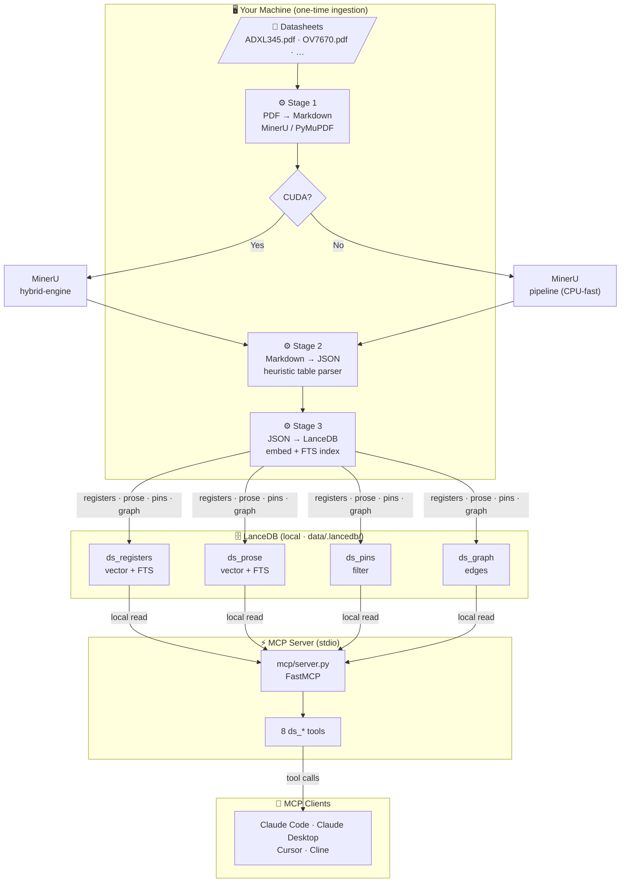
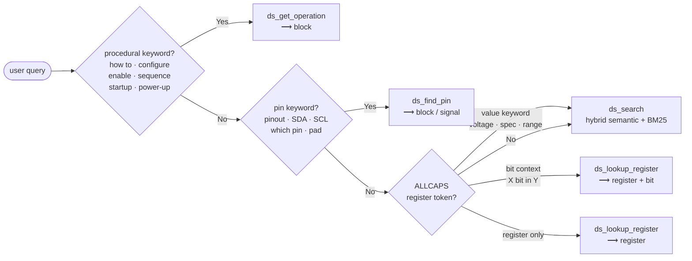
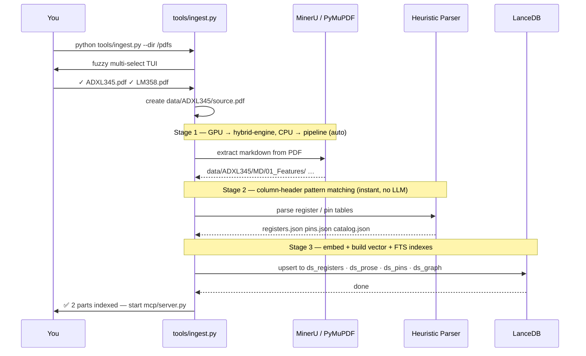

# 📋 Datasheet MCP Server

> **Component Datasheet Understanding** — turns multi-page IC datasheet PDFs into
> exact, part-scoped register and bit answers in ~250 tokens, served over the
> Model Context Protocol. Runs **100 % locally** — no cloud server, no API key required.

---

## 🏗️ Architecture



### ✨ Search quality

`ds_search` uses hybrid retrieval — dense cosine vectors + BM25 full-text fused with
`LinearCombinationReranker` (70 % semantic + 30 % keyword). Keyword-exact and
semantically-similar passages are ranked together in one pass.

| Feature | Benefit |
|---|---|
| 🔀 Hybrid dense + BM25 vectors | Best result ranked first — symbol and meaning in one call |
| 🎯 Prefetch oversampling (k×4) | Better recall — fewer relevant passages missed |
| 🗂️ Block-diverse grouping | Results spread across functional blocks, not monopolised by one |
| 🔍 Semantic register fuzzy match | "power on" finds `POWER_CTL` without knowing the exact symbol |
| 🧩 Dependency graph | `ds_neighbors` traces what must be enabled before a register works |

---

## ⚡ Connect a client

The `.mcp.json` at the repo root is pre-configured for **stdio** (local) mode.
Update the path to point at your local checkout.

### 🤖 Claude Code

Edit `.mcp.json` in your project root:

```json
{
  "mcpServers": {
    "ds": {
      "command": "python",
      "args": ["/path/to/08_datasheetMCP/mcp/server.py"]
    }
  }
}
```

> **Windows tip:** right-click `mcp/server.py` → *Copy as path*, then paste inside the JSON array.

Run `claude` from the repo root. Approve the **ds** server when prompted.

---

### 🖥️ Claude Desktop

Edit `claude_desktop_config.json` (Settings → Developer → Edit Config):

- **Windows:** `%APPDATA%\Claude\claude_desktop_config.json`
- **macOS:** `~/Library/Application Support/Claude/claude_desktop_config.json`

```json
{
  "mcpServers": {
    "ds": {
      "command": "python",
      "args": ["/path/to/08_datasheetMCP/mcp/server.py"]
    }
  }
}
```

Restart Claude Desktop — **ds** appears under the tools menu.

---

### 🔧 Cursor / Cline / Continue

Paste into the MCP settings UI or `cline_mcp_settings.json`:

```json
{
  "mcpServers": {
    "ds": {
      "command": "python",
      "args": ["/path/to/08_datasheetMCP/mcp/server.py"]
    }
  }
}
```

---

## 🛠️ The tools

| Tool | Args | What it does |
|---|---|---|
| `ds_auto` | `part`, `query` | 🚦 **Start here** — single entry point that auto-routes to the right backend |
| `ds_search` | `part`, `query` | 🔍 Hybrid semantic + keyword search — spec tables, supply voltage, overviews |
| `ds_lookup_register` | `part`, `register` | 📄 Full register card — addresses + every bit field |
| `ds_lookup_register` | `part`, `register`, `bit=…` | 🔬 Single bit/field row — `MEASURE`, `FULL_RES`, `RANGE[1:0]` |
| `ds_get_operation` | `part`, `block` | ⚙️ Init sequence, power-up procedure, operating modes |
| `ds_find_pin` | `part` | 📌 Full pinout — signal names, types, descriptions |
| `ds_neighbors` | `part`, `node` | 🧩 Dependency graph — what a block or register depends on |
| `ds_list_parts` | — | 📋 List all indexed parts — call first if unsure of the part name |
| `ds_list_blocks` | `part` | 📦 List functional blocks and register counts for a part |

> ⚠️ **`part` is required on every call.** This prevents identically named registers
> on different ICs from ever mixing up their data.

**📋 Recommended order for working with a datasheet:**

```
1. ds_list_parts            → confirm the part name is indexed
2. ds_list_blocks           → see available functional blocks
3. ds_get_operation         → understand init sequence and modes first
4. ds_lookup_register       → look up each register by symbol
5. ds_lookup_register + bit → drill into a specific bit if needed
6. ds_search                → open-ended conceptual / spec questions
7. ds_find_pin              → pinout and signal assignments
8. ds_neighbors             → trace register / block dependencies
```

### Query routing inside `ds_auto`



---

## 📦 Adding a new datasheet

### Step 0 — Get the project

```bash
git clone https://github.com/hungnguyen1503/datasheet-mcp.git
cd 08_datasheetMCP
pip install -r mcp/requirements.txt
pip install InquirerPy          # optional — adds fuzzy TUI selector
```

> **No LLM required.** Stage 2 uses a heuristic markdown-table parser (column-header
> pattern matching). No LMStudio, Ollama, or API key needed.

### Step 1 — Ingest with the unified CLI (recommended)

```bash
# Scan a folder, pick PDFs interactively, run all stages automatically:
python tools/ingest.py --dir /path/to/your/pdfs

# Or ingest a single file directly (skips the TUI):
python tools/ingest.py --pdf /downloads/LM358.pdf

# Flags:
#   --no-extract      skip table extraction (use cached registers.json)
#   --no-prose        skip prose index  (registers + pins only, fastest)
#   --no-graph        skip dependency graph build
#   --reset           drop existing LanceDB tables and rebuild from scratch
#   --backend pymupdf use PyMuPDF instead of MinerU (no GPU needed)
```

**What happens under the hood:**



### Step 2 — Manual stage-by-stage (alternative)

```bash
# Stage 1: PDF → chapter markdown
#   GPU: MinerU hybrid-engine (understands table structure via VLM)
#   CPU: MinerU pipeline (text-only, auto-selected, fast)
python tools/pdf_to_md.py --pdf /downloads/ADXL345.pdf
# → data/ADXL345/source.pdf  +  data/ADXL345/MD/NN_Section/…

# Stage 2: heuristic table extraction (no LLM — instant, deterministic)
python tools/extract_structured.py --part ADXL345
# → data/ADXL345/registers.json  pins.json  catalog.json

# Stage 3: embed + index into LanceDB
cd mcp
build.bat --part ADXL345           # Windows
bash build.sh --part ADXL345       # Linux / macOS

# Re-index after switching embedding model:
build.bat --part ADXL345 --reset
```

### Step 3 — Verify

```bash
cd 08_datasheetMCP

python -m pytest tests/ -q                  # 160 unit tests, ~0.4 s
python mcp/server.py                         # server starts — Ctrl+C to stop
```

Then in Claude Code or the MCP Inspector:

```
ds_list_parts()                              # ADXL345 should appear
ds_list_blocks("ADXL345")                   # check block list
ds_lookup_register("ADXL345", "POWER_CTL") # spot-check a register
```

---

## 🔍 Verify extraction quality

After ingestion, check `registers.json` — if a register you expect is missing, the
table's column headers did not match the heuristic patterns.

| Situation | Action |
|---|---|
| ✅ Standard headers (`Bit`, `Symbol`, `R/W`, `Description`) | Works automatically |
| ⚠️ Non-English or unusual headers | Table is skipped but still in `ds_prose` — `ds_search` still finds it |
| ⚠️ Register count is 0 | Run `python tools/extract_structured.py --part <P>` and inspect output |
| 🔧 Register address not captured | Check that the heading above the table contains a hex address like `(0x2D)` |

---

## 🔧 Maintenance

**♻️ Re-index a part after editing extraction:**

```bash
cd 08_datasheetMCP
python tools/extract_structured.py --part ADXL345 --reset
cd mcp && build.bat --part ADXL345 --reset
```

**🧪 Run the tests:**

```bash
cd 08_datasheetMCP
python -m pytest tests/ -v
```

**🗑️ Remove a part entirely:**

```bash
cd 08_datasheetMCP/mcp
python -c "from ds.db import get_db; db=get_db(); [db.open_table(t).delete(\"part='ADXL345'\") for t in db.list_tables()]"
```

---

## ⚙️ Configuration

Copy `mcp/.env.example` to `mcp/.env` and adjust as needed.

```bash
cd 08_datasheetMCP
cp mcp/.env.example mcp/.env
```

| Variable | Default | Purpose |
|---|---|---|
| `DS_DB_PATH` | `data/.lancedb` | LanceDB storage directory (relative to repo root) |
| `DS_EMBED_MODEL` | `BAAI/bge-small-en-v1.5` | Sentence-transformers model (384-dim, CPU-friendly) |
| `DS_EMBED_DEVICE` | auto (`cuda` → `cpu`) | Embedding device override |
| `DS_EMBED_BATCH_SIZE` | 256 GPU / 32 CPU | Reduce to 16 on low-RAM machines |
| `DS_RERANKER_MODEL` | *(unset)* | Optional cross-encoder, e.g. `cross-encoder/ms-marco-MiniLM-L-6-v2` |
| `DS_TRANSPORT` | `stdio` | MCP transport: `stdio` / `streamable-http` / `sse` |
| `DS_HOST` | `0.0.0.0` | Host for HTTP transport |
| `DS_PORT` | `8002` | Port for HTTP transport |
| `DS_API_KEYS` | *(unset)* | Comma-separated bearer tokens — enables auth for HTTP mode |
| `MINERU_DEVICE_MODE` | auto | MinerU device override: `cuda` / `cpu` |

### Embedding model options

| Model | Dim | Size | Best for |
|---|---|---|---|
| `BAAI/bge-small-en-v1.5` **(default)** | 384 | ~130 MB | Any CPU laptop |
| `BAAI/bge-base-en-v1.5` | 768 | ~440 MB | CPU with ≥ 16 GB RAM |
| `BAAI/bge-large-en-v1.5` | 1024 | ~1.3 GB | GPU recommended |

> After changing `DS_EMBED_MODEL`, re-run `build.bat --part <P> --reset` to rebuild
> the vector index with the new dimensions.

### 🔐 Access control (HTTP mode only)

HUM-style static bearer-token auth — only needed when `DS_TRANSPORT=streamable-http`.

1. Generate a token:
   ```bash
   python3 -c "import secrets; print(secrets.token_hex(32))"
   ```
2. Add it to `mcp/.env`:
   ```
   DS_API_KEYS=token1here,token2here
   ```
3. Restart the server.
4. Clients add a header: `Authorization: Bearer <your-token>`

> 🔓 When `DS_API_KEYS` is unset the server runs in **open mode** — fine for local use.

---

## 🗄️ LanceDB tables

| Table | Vectors | FTS | Key fields | Used by |
|---|---|---|---|---|
| `ds_registers` | dense 384-dim | `register`, `name` | vendor, part, block, register, bitfields (JSON), addresses (JSON) | `ds_lookup_register`, `ds_search` |
| `ds_prose` | dense 384-dim | `text`, `heading`, `breadcrumb` | part, block, section, is_operation | `ds_search`, `ds_get_operation` |
| `ds_pins` | none | none | part, block, pin, signal, type, description | `ds_find_pin` |
| `ds_graph` | none | none | part, edge_type, source_id, target_id, label, weight | `ds_neighbors` |

---

## 📁 Project structure

```
08_datasheetMCP/
├── .mcp.json                  ← Claude Code MCP registration
├── mcp/
│   ├── server.py              ← MCP server entrypoint
│   ├── build.bat / build.sh   ← Stage 3 build scripts (Windows / Linux)
│   ├── requirements.txt
│   ├── .env.example
│   └── ds/                    ← main Python package
│       ├── mcp_server.py      ← FastMCP tool definitions (8 tools)
│       ├── query.py           ← DS facade (lookup / search / auto)
│       ├── router.py          ← regex query classifier
│       ├── model.py           ← RegisterCard, Pin, ProseBlock, …
│       ├── embed.py           ← GPU/CPU adaptive embedder
│       ├── db.py              ← LanceDB connection singleton
│       ├── catalog.py         ← part/section discovery
│       ├── cards.py           ← register card renderer
│       ├── index/             ← LanceDB table wrappers
│       │   ├── registers.py
│       │   ├── prose.py
│       │   └── pins.py
│       ├── ingest/            ← ingestion pipeline
│       │   ├── extract.py     ← heuristic table parser (no LLM)
│       │   ├── prose.py       ← markdown → ProseBlock
│       │   └── build.py       ← JSON → LanceDB orchestrator
│       └── graph/             ← dependency graph
│           ├── model.py · store.py · build.py · query.py
├── tools/
│   ├── ingest.py              ← unified CLI (fuzzy pick + all stages)
│   ├── pdf_to_md.py           ← Stage 1: PDF → Markdown
│   └── extract_structured.py  ← Stage 2: Markdown → JSON (heuristic)
├── data/
│   ├── .lancedb/              ← LanceDB vector store (auto-created)
│   └── ADXL345/               ← one folder per indexed part
│       ├── source.pdf
│       ├── MD/                ← MinerU markdown sections
│       ├── registers.json
│       ├── pins.json
│       └── catalog.json
└── tests/                     ← 160 unit tests (no DB / LLM needed)
```

---

## 🩺 Troubleshooting

| Symptom | Fix |
|---|---|
| ❌ `ds_list_parts()` returns empty | Parts not indexed — run `python tools/ingest.py` |
| ❌ `MinerU not found` | `pip install mineru` or use `--backend pymupdf` |
| ⚠️ `dim mismatch — recreating table` | `DS_EMBED_MODEL` changed — expected, table auto-rebuilds |
| ⚠️ No results from `ds_lookup_register` | Register not extracted — check `data/<P>/registers.json`; table headers may be non-standard |
| ⚠️ `ds_search` returns empty on first call | Embedding model is still loading (~10 s). Retry for full results. |
| ⚠️ `ds_get_operation` returns nothing | No operation-heading text found — `ds_search` with the query still works |
| ❌ No hybrid search results | FTS index not built — re-run `build.bat --part <P>` after data is added |
| ⏱️ CPU indexing very slow | Reduce batch size: `DS_EMBED_BATCH_SIZE=16` in `mcp/.env` |
| ❌ Build fails: `No markdown found` | Stage 1 not run — run `python tools/pdf_to_md.py --part <P>` first |
