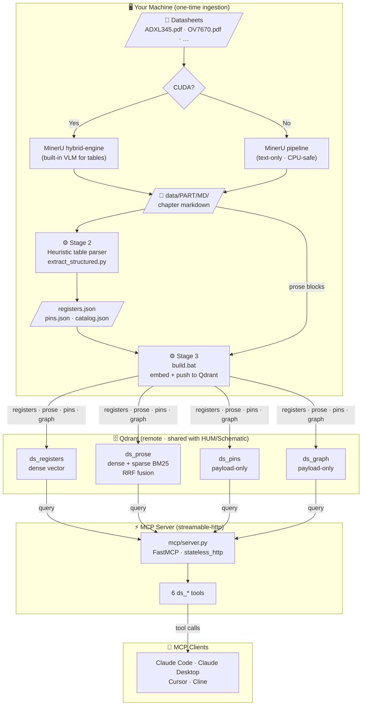
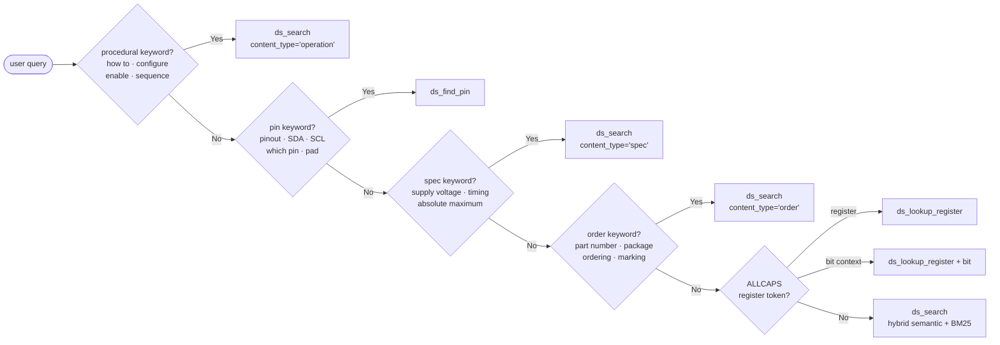

# 📋 Datasheet MCP Server

> **Component Datasheet Understanding** — turns multi-page IC datasheet PDFs into
> exact, part-scoped register, spec, and pin answers in ~250 tokens, served over the
> Model Context Protocol. Uses **Qdrant** hybrid vector search (shared with HUM MCP
> and Schematic MCP), deployed via Cloudflare Tunnel.

---

## ⚡ Quick start

```bash
# 1. Clone and install
git clone https://github.com/hungnguyen1503/datasheet-mcp.git
cd datasheet-mcp
pip install -r mcp/requirements.txt

# 2. Register with your AI client — add to .mcp.json:
#    "ds": { "url": "https://datasheetmcp.hungnguyenjx.space/mcp",
#            "headers": { "Authorization": "Bearer <token>" } }

# 3. Start querying — pre-indexed parts are ready immediately:
#    ds_auto("ADXL345", "how do I configure the FIFO?")
#    ds_lookup_register("ADXL345", "POWER_CTL")
#    ds_find_pin("ADXL345")
```

To **add your own datasheet**, drop the PDF in a folder and run:

```bash
python tools/ingest.py --pdf /path/to/YourPart.pdf
```

That's it — the folder, markdown, and Qdrant index are created automatically.

---

## 🏗️ Architecture


```mermaid
graph TB
    subgraph Build["🖥️ Your Machine  (one-time ingestion)"]
        PDF[/"📄 Datasheets<br/>ADXL345.pdf · OV7670.pdf · …"/]
        GPU{"CUDA?"}
        S1H["MinerU hybrid-engine<br/>(built-in VLM for tables)"]
        S1P["MinerU pipeline<br/>(text-only · CPU-safe)"]
        MD[/"📁 data/PART/MD/<br/>chapter markdown"/]
        S2["⚙️ Stage 2<br/>Heuristic table parser<br/>extract_structured.py"]
        JSON[/"registers.json<br/>pins.json · catalog.json"/]
        S3["⚙️ Stage 3<br/>build.bat<br/>embed + push to Qdrant"]
    end

    subgraph DB["🗄️ Qdrant  (remote · shared with HUM/Schematic)"]
        R["ds_registers<br/>dense vector"]
        P["ds_prose<br/>dense + sparse BM25<br/>RRF fusion"]
        PI["ds_pins<br/>payload-only"]
        G["ds_graph<br/>payload-only"]
    end

    subgraph Server["⚡ MCP Server  (streamable-http)"]
        SRV["mcp/server.py<br/>FastMCP · stateless_http"]
        TOOLS["6 ds_* tools"]
    end

    subgraph Clients["💬 MCP Clients"]
        CLI["Claude Code · Claude Desktop<br/>Cursor · Cline"]
    end

    PDF --> GPU
    GPU -- "Yes" --> S1H --> MD
    GPU -- "No"  --> S1P --> MD
    MD --> S2 --> JSON --> S3
    MD -->|"prose blocks"| S3
    S3 -->|"registers · prose · pins · graph"| R & P & PI & G
    R & P & PI & G -->|"query"| SRV
    SRV --> TOOLS -->|"tool calls"| CLI
```

> **No CLIP, no visual search.** All retrieval is text-only — dense BGE vectors + BM25
> sparse vectors with RRF fusion. The `hybrid-engine` label refers to MinerU's internal
> PDF parsing strategy (text + layout + table VLM), **not** cross-modal image/text embedding.

### ✨ Search quality

`ds_search` uses hybrid retrieval — dense cosine vectors + sparse BM25 fused with
**RRF** (Reciprocal Rank Fusion). Keyword-exact and semantically-similar passages
are ranked together in one pass.

| Feature | Benefit |
|---|---|
| 🔀 Hybrid dense + sparse BM25 with RRF | Best result ranked first — symbol and meaning in one call |
| 🗂️ Block-diverse grouping | Results spread across functional blocks, not monopolised by one |
| 🔍 Semantic register fuzzy match | "power on" finds `POWER_CTL` without knowing the exact symbol |
| 🏷️ content_type filtering | `"operation"` / `"spec"` / `"order"` — precise retrieval by section type |
| 🔁 Optional cross-encoder reranker | `DS_RERANKER_MODEL` boosts precision on ambiguous queries |
| 🧩 Dependency graph | `ds_neighbors` traces what must be enabled before a register works |

---

## ☁️ Remote deployment

The server is deployed at **`https://datasheetmcp.hungnguyenjx.space/mcp`** via:

- **systemd** service (`deploy/datasheetmcp.service`) — runs `mcp/server.py` with `streamable-http` transport
- **Cloudflare Tunnel** (`deploy/docker-compose.yml`) — exposes `localhost:8060` securely
- **Qdrant** — shared vector store at `localhost:6333` (same instance as HUM/Schematic MCP)
- **Bearer-token auth** — optional, controlled via `DS_API_KEYS` env var

### 🤖 Claude Code

The `.mcp.json` at the repo root is pre-configured for the **remote** cloudflared endpoint:

```json
{
  "mcpServers": {
    "ds": {
      "url": "https://datasheetmcp.hungnguyenjx.space/mcp",
      "headers": {
        "Authorization": "Bearer <your-token>"
      }
    }
  }
}
```

For **local dev**, use stdio mode instead:

```json
{
  "mcpServers": {
    "ds": {
      "command": "python",
      "args": ["/path/to/datasheet-mcp/mcp/server.py"]
    }
  }
}
```

---

## 🛠️ The tools

6 tools total. Always start with **`ds_auto`** — it routes to the correct backend automatically.

| Tool | Args | What it does |
|---|---|---|
| `ds_auto` | `part`, `query` | 🚦 **Start here** — auto-routes every query to the right backend |
| `ds_search` | `part`, `query`, `content_type` | 🔍 Hybrid search; `content_type="operation"` for procedures, `"spec"` for electrical/timing specs, `"order"` for part numbers |
| `ds_lookup_register` | `part`, `register` | 📄 Full register card (addresses + bit fields); add `bit=` for a single bit/field row |
| `ds_find_pin` | `part` | 📌 Full pinout — signal names, I/O types, descriptions |
| `ds_neighbors` | `part`, `node` | 🧩 Dependency graph — what a block or register depends on |
| `ds_list` | `[part]` | 📋 Omit `part` → list all indexed parts; supply `part` → list its blocks |

> ⚠️ **`part` is required on every call except `ds_list()`.** This prevents identically
> named registers on different ICs from ever mixing up their data.

### `ds_search` content_type modes

| content_type | Use for | Example queries |
|---|---|---|
| `""` (default) | All content — hybrid vector + BM25 | "what is the FIFO mode?", "output data rate" |
| `"operation"` | Init / procedure / how-to | "how to configure FIFO", "power-up sequence" |
| `"spec"` | Electrical / timing / ratings | "supply voltage range", "I2C timing", "absolute maximum" |
| `"order"` | Part numbers / packages / ordering | "available package options", "ordering codes" |

### Query routing inside `ds_auto`


```mermaid
flowchart LR
    Q(["user query"]) --> R1{"procedural keyword?\nhow to · configure\nenable · sequence"}
    R1 -- Yes --> OP["ds_search\ncontent_type='operation'"]

    R1 -- No --> R2{"pin keyword?\npinout · SDA · SCL\nwhich pin · pad"}
    R2 -- Yes --> PIN["ds_find_pin"]

    R2 -- No --> R3{"spec keyword?\nsupply voltage · timing\nabsolute maximum"}
    R3 -- Yes --> SPEC["ds_search\ncontent_type='spec'"]

    R3 -- No --> R4{"order keyword?\npart number · package\nordering · marking"}
    R4 -- Yes --> ORDER["ds_search\ncontent_type='order'"]

    R4 -- No --> R5{"ALLCAPS\nregister token?"}
    R5 -- "register" --> REG["ds_lookup_register"]
    R5 -- "bit context" --> BIT["ds_lookup_register + bit"]
    R5 -- No --> SRCH["ds_search\nhybrid semantic + BM25"]
```

---

## 📦 Adding a new datasheet

> **No LLM required.** Stage 2 uses a heuristic markdown-table parser.
> No LMStudio, Ollama, or API key needed.

### Step 1 — Ingest with the unified CLI (recommended)

```bash
python tools/ingest.py --pdf /downloads/LM358.pdf      # single file
python tools/ingest.py --dir /path/to/pdfs             # pick from folder (fuzzy TUI)
python tools/ingest.py --pdf LM358.pdf --backend pymupdf  # CPU-only, no MinerU needed

# Other flags: --no-prose  --no-graph  --no-extract  --reset
```

### Step 2 — Manual stage-by-stage (alternative)

```bash
# Stage 1: PDF → chapter markdown
python tools/pdf_to_md.py --pdf /downloads/ADXL345.pdf

# Stage 2: heuristic table extraction (no LLM — instant, deterministic)
python tools/extract_structured.py --part ADXL345

# Stage 3: embed + push to Qdrant
cd mcp
build.bat --part ADXL345        # Windows
bash build.sh --part ADXL345    # Linux / macOS
```

### Step 3 — Verify

```bash
python -m pytest tests/ -q                  # unit tests
DS_TRANSPORT=stdio python mcp/server.py      # local test — Ctrl+C to stop
```

---

## ⚙️ Configuration

Copy `mcp/.env.example` to `mcp/.env` and adjust as needed.

| Variable | Default | Purpose |
|---|---|---|
| `DS_TRANSPORT` | `streamable-http` | MCP transport: `stdio` / `streamable-http` |
| `DS_HOST` | `127.0.0.1` | Host for HTTP transport |
| `DS_PORT` | `8060` | Port for HTTP transport |
| `QDRANT_URL` | `http://localhost:6333` | Qdrant server URL |
| `QDRANT_API_KEY` | *(set in deploy)* | Qdrant API key |
| `DS_API_KEYS` | *(unset)* | Comma-separated bearer tokens for HTTP auth |
| `DS_EMBED_MODEL` | `BAAI/bge-small-en-v1.5` | Sentence-transformers model (384-dim, CPU-friendly) |
| `DS_RERANKER_MODEL` | `cross-encoder/ms-marco-MiniLM-L-6-v2` | Optional cross-encoder reranker |

### Embedding model options

| Model | Dim | Size | Best for |
|---|---|---|---|
| `BAAI/bge-small-en-v1.5` **(default)** | 384 | ~130 MB | Any CPU laptop |
| `BAAI/bge-base-en-v1.5` | 768 | ~440 MB | CPU with ≥ 16 GB RAM |
| `BAAI/bge-large-en-v1.5` | 1024 | ~1.3 GB | GPU recommended |

> After changing `DS_EMBED_MODEL`, drop and rebuild the Qdrant collections with the new dimensions.

---

## 🗄️ Qdrant collections

| Collection | Vectors | Indexes | Key fields | Used by |
|---|---|---|---|---|
| `ds_registers` | dense 384-dim | KEYWORD: part, block; TEXT: register, name | vendor, part, block, register, bitfields (JSON) | `ds_lookup_register`, `ds_search` |
| `ds_prose` | dense + sparse BM25 | KEYWORD: part, block, content_type | part, block, section, heading, breadcrumb, text, content_type | `ds_search` |
| `ds_pins` | none (payload-only) | KEYWORD: part, block, signal | part, block, pin, signal, type, description | `ds_find_pin` |
| `ds_graph` | none (payload-only) | KEYWORD: part, source_id, target_id, edge_type | part, edge_type, source_id, target_id, label, weight | `ds_neighbors` |
| `ds_catalog` | none (payload-only) | KEYWORD: part, vendor | vendor, part, block, revision | `ds_list` |

---

## 📁 Project structure

```
datasheet-mcp/
├── .mcp.json                  ← Claude Code MCP registration (cloudflared URL)
├── deploy/
│   ├── docker-compose.yml     ← Cloudflared tunnel container
│   ├── datasheetmcp.service   ← systemd service unit
│   └── .env.example           ← Deployment env template
├── mcp/
│   ├── server.py              ← MCP server entrypoint
│   ├── build.bat / build.sh   ← Stage 3 build scripts (Windows / Linux)
│   ├── requirements.txt
│   ├── .env.example
│   └── ds/                    ← main Python package
│       ├── mcp_server.py      ← FastMCP tool definitions (6 tools)
│       ├── query.py           ← DS facade (lookup / search / auto)
│       ├── router.py          ← regex query classifier
│       ├── model.py           ← RegisterCard, Pin, ProseBlock, …
│       ├── embed.py           ← GPU/CPU adaptive embedder
│       ├── collections.py     ← Qdrant collection prefix helper
│       ├── catalog.py         ← part/section discovery
│       ├── cards.py           ← register card renderer
│       ├── index/             ← Qdrant store wrappers
│       │   ├── regstore_qdrant.py  ← Register + catalog + pin store
│       │   ├── prose_qdrant.py     ← Hybrid dense + sparse prose index
│       │   └── pins_qdrant.py      ← Pin store wrapper
│       ├── ingest/            ← ingestion pipeline
│       │   ├── extract.py     ← heuristic table parser (no LLM)
│       │   ├── prose.py       ← markdown → ProseBlock + content_type
│       │   └── build.py       ← JSON → Qdrant orchestrator
│       └── graph/             ← dependency graph
│           ├── model.py · store_qdrant.py · build.py · query.py
├── tools/
│   ├── ingest.py              ← unified CLI (fuzzy pick + all stages)
│   ├── pdf_to_md.py           ← Stage 1: PDF → Markdown
│   └── extract_structured.py  ← Stage 2: Markdown → JSON (heuristic)
├── data/
│   └── ADXL345/               ← one folder per indexed part
│       ├── source.pdf
│       ├── MD/                ← MinerU markdown sections
│       ├── registers.json      ← extracted by Stage 2 heuristic parser
│       ├── pins.json
│       └── catalog.json
└── tests/                     ← unit tests
```

---

## 🩺 Troubleshooting

| Symptom | Fix |
|---|---|
| ❌ `ds_list()` returns empty | Parts not indexed — run `python tools/ingest.py` |
| ❌ `MinerU not found` | `pip install mineru` or use `--backend pymupdf` |
| ❌ Cannot connect to Qdrant | Check `QDRANT_URL` in `mcp/.env`; ensure Qdrant is running on port 6333 |
| ⚠️ No results from `ds_lookup_register` | Register not extracted — check `data/<P>/registers.json` |
| ⚠️ `ds_search` returns empty on first call | Embedding model is still loading (~10 s). Retry for full results. |
| ⚠️ `ds_search(content_type="operation")` returns nothing | No operation-heading text found — try `content_type=""` |
| ❌ Build fails: `No markdown found` | Stage 1 not run — run `python tools/pdf_to_md.py --part <P>` first |
