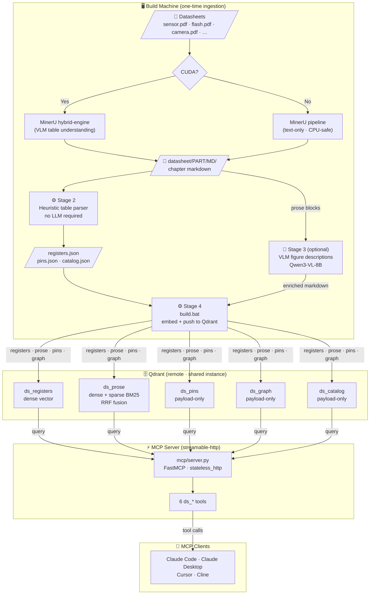
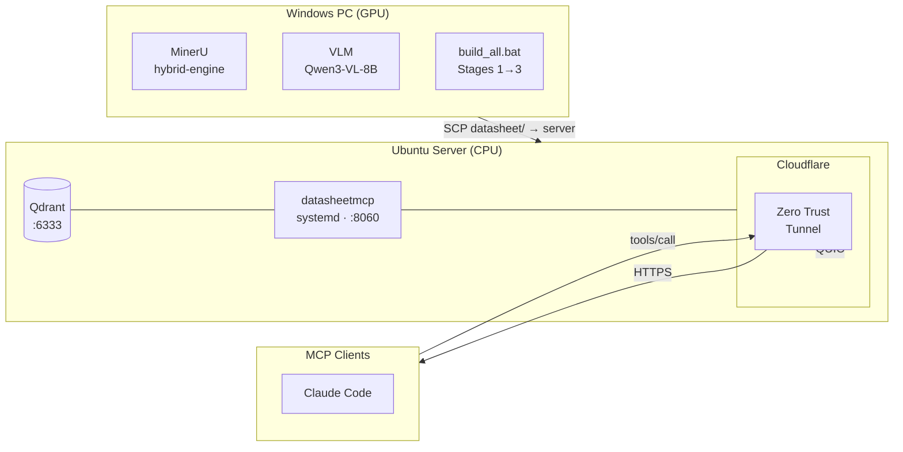

# 📋 Datasheet MCP Server

> **Component Datasheet Understanding** — turns multi-page IC datasheet PDFs into
> exact, part-scoped register, spec, and pin answers in ~250 tokens, served over the
> Model Context Protocol. Uses **Qdrant** hybrid vector search (dense BGE + sparse BM25
> with RRF fusion), deployed via Cloudflare Tunnel.

---

## ⚡ Quick start

```bash
# 1. Clone and install
git clone https://github.com/hungnguyen1503/datasheet-mcp.git
cd datasheet-mcp
pip install -r mcp/requirements.txt

# 2. Add to your MCP client (.mcp.json or Claude Desktop config):
# {
#   "mcpServers": {
#     "ds": {
#       "url": "https://datasheetmcp.hungnguyenjx.space/mcp",
#       "headers": { "Authorization": "Bearer <token>" }
#     }
#   }
# }

# 3. Start querying:
#    ds_auto("ADXL345", "how do I configure the FIFO?")
#    ds_lookup_register("ADXL345", "POWER_CTL")
#    ds_search("ADXL345", "supply voltage range", content_type="spec")
```

To **add your own datasheet**, drop the PDF in a folder and run:

```bash
python tools/ingest.py --pdf /path/to/Part.pdf
```

That's it — the folder, markdown, and Qdrant index are created automatically.

---

## 🏗️ Architecture


```mermaid
graph TB
    subgraph Build["🖥️ Build Machine  (one-time ingestion)"]
        PDF[/"📄 Datasheets<br/>sensor.pdf · flash.pdf · camera.pdf · …"/]
        GPU{"CUDA?"}
        S1H["MinerU hybrid-engine<br/>(VLM table understanding)"]
        S1P["MinerU pipeline<br/>(text-only · CPU-safe)"]
        MD[/"📁 datasheet/PART/MD/<br/>chapter markdown"/]
        S2["⚙️ Stage 2<br/>Heuristic table parser<br/>no LLM required"]
        JSON[/"registers.json<br/>pins.json · catalog.json"/]
        S3["🎨 Stage 3 (optional)<br/>VLM figure descriptions<br/>Qwen3-VL-8B"]
        S4["⚙️ Stage 4<br/>build.bat<br/>embed + push to Qdrant"]
    end

    subgraph DB["🗄️ Qdrant  (remote · shared instance)"]
        R["ds_registers<br/>dense vector"]
        P["ds_prose<br/>dense + sparse BM25<br/>RRF fusion"]
        PI["ds_pins<br/>payload-only"]
        G["ds_graph<br/>payload-only"]
        C["ds_catalog<br/>payload-only"]
    end

    subgraph Server["⚡ MCP Server  (streamable-http)"]
        SRV["mcp/server.py<br/>FastMCP · stateless_http"]
        TOOLS["6 ds_* tools"]
    end

    subgraph Clients["💬 MCP Clients"]
        CLI["Claude Code · Claude Desktop<br/>Cursor · Cline"]
    end

    PDF --> GPU
    GPU -- "Yes" --> S1H --> MD
    GPU -- "No"  --> S1P --> MD
    MD --> S2 --> JSON --> S4
    MD -->|"prose blocks"| S3 -->|"enriched markdown"| S4
    S4 -->|"registers · prose · pins · graph"| R & P & PI & G & C
    R & P & PI & G & C -->|"query"| SRV
    SRV --> TOOLS -->|"tool calls"| CLI
```

> **No CLIP, no visual search.** All retrieval is text-only — dense BGE vectors + BM25
> sparse vectors with RRF fusion. The `hybrid-engine` label refers to MinerU's internal
> PDF parsing strategy (text + layout + table VLM), **not** cross-modal image/text embedding.

---

## 📡 Deployment topology


```mermaid
flowchart LR
    subgraph Win["Windows PC  (GPU)"]
        MinerU["MinerU<br/>hybrid-engine"]
        VLM["VLM<br/>Qwen3-VL-8B"]
        Build["build_all.bat<br/>Stages 1→3"]
    end

    subgraph Svr["Ubuntu Server  (CPU)"]
        Qdrant[("Qdrant<br/>:6333")]
        DS["datasheetmcp<br/>systemd · :8060"]
        CF["cloudflared<br/>docker"]
    end

    subgraph CF["Cloudflare"]
        Edge["Zero Trust<br/>Tunnel"]
    end

    subgraph Client["MCP Clients"]
        CC["Claude Code"]
    end

    Win -- "SCP datasheet/ → server" --> Svr
    Qdrant --- DS
    DS --- CF
    CF -- "QUIC" --> Edge
    Edge -- "HTTPS" --> Client
    Client -- "tools/call" --> Edge
```

- **Stages 1–3** run on a GPU machine (MinerU PDF→MD, VLM figure descriptions)
- **Stage 4** runs on the server (embed + push to Qdrant)
- The MCP server runs on **port 8060**, exposed via **Cloudflare Tunnel**
- Qdrant is shared with the HUM MCP and Schematic MCP servers

---

## 🛠️ The tools

6 tools total. Always start with **`ds_auto`** — it routes to the correct backend automatically.

| Tool | Args | What it does |
|---|---|---|
| `ds_auto` | `part`, `query` | 🚦 **Start here** — auto-routes every query: register names, procedures, pins, specs, ordering |
| `ds_search` | `part`, `query`, `content_type` | 🔍 Hybrid search; `content_type="operation"` for procedures, `"spec"` for electrical/timing specs, `"order"` for part numbers |
| `ds_lookup_register` | `part`, `register` | 📄 Full register card (addresses + bit fields); add `bit=` for a single bit/field row |
| `ds_find_pin` | `part` | 📌 Full pinout — signal names, I/O types, descriptions |
| `ds_neighbors` | `part`, `node` | 🧩 Dependency graph — what a block or register depends on |
| `ds_list` | `[part]` | 📋 Omit `part` → list all indexed parts; supply `part` → list its blocks |

> ⚠️ **`part` is required on every call except `ds_list()`.** This prevents identically
> named registers on different ICs from ever mixing up their data.

### `ds_search` content_type modes

| content_type | Use for | Example queries |
|---|---|---|
| `""` (default) | All content — hybrid vector + BM25 | "what is the FIFO mode?", "output data rate" |
| `"operation"` | Init / procedure / how-to | "how to configure FIFO", "power-up sequence" |
| `"spec"` | Electrical / timing / ratings | "supply voltage range", "I2C timing", "absolute maximum" |
| `"order"` | Part numbers / packages / ordering | "available package options", "ordering codes" |

---

## 📦 Pipeline

Full 4-stage ingestion pipeline for one or more IC datasheet PDFs.

### Stage overview

| Stage | Script | What it does | ML? |
|---|---|---|---|
| **1** | `tools/pdf_to_md.py` | PDF → chapter markdown via MinerU (hybrid-engine on GPU, pipeline on CPU) | GPU |
| **2** | `tools/extract_structured.py` | Markdown → registers.json + pins.json (heuristic, no LLM) | — |
| **3** | `tools/describe_images.py` | VLM figure descriptions for timing diagrams, block diagrams, pinouts (optional) | GPU VLM |
| **4** | `mcp/build.bat` / `mcp/build.sh` | Embed + push to Qdrant | — |

### Quick run

```bash
# Interactive — pick which PDF to ingest
build_all.bat

# Single part, full pipeline
build_all.bat --part ADXL345

# Index only (re-index after model change)
build_all.bat --part ADXL345 --index-only

# Non-interactive
build_all.bat --part ADXL345 --yes
```

### Manual stage-by-stage

```bash
# Stage 1: PDF → Markdown (MinerU, hybrid-engine on GPU)
python tools/pdf_to_md.py --pdf /path/to/Part.pdf

# Stage 2: Markdown → JSON (heuristic, instant)
python tools/extract_structured.py --part PartName

# Stage 3: VLM figure descriptions (optional, requires LM Studio with Qwen3-VL-8B)
python tools/describe_images.py --part PartName

# Stage 4: Index to Qdrant
cd mcp && build.bat --part PartName
```

### Resumability

Each stage checks whether its output already exists and skips automatically:
- **Stage 1**: `datasheet/<PART>/MD/` exists and non-empty
- **Stage 2**: `datasheet/<PART>/registers.json` exists
- **Stage 3**: `.describe_images.json` cache exists with all images processed
- **Stage 4**: Data present in Qdrant collections

Use `pipeline.py` for zero-interaction runs with sentinel-based completion tracking:

```bash
python tools/pipeline.py --part ADXL345 --yes
```

---

## ⚙️ Configuration

| Variable | Default | Purpose |
|---|---|---|
| `DS_TRANSPORT` | `streamable-http` | MCP transport: `stdio` / `streamable-http` |
| `DS_HOST` | `127.0.0.1` | Host for HTTP transport |
| `DS_PORT` | `8060` | Port for HTTP transport |
| `QDRANT_URL` | `http://localhost:6333` | Qdrant server URL |
| `QDRANT_API_KEY` | *(set in deploy)* | Qdrant API key |
| `DS_API_KEYS` | *(unset)* | Comma-separated bearer tokens for HTTP auth |
| `DS_EMBED_MODEL` | `BAAI/bge-small-en-v1.5` | Sentence-transformers model (384-dim) |
| `DS_RERANKER_MODEL` | `cross-encoder/ms-marco-MiniLM-L-6-v2` | Optional cross-encoder reranker |
| `MINERU_DEVICE_MODE` | auto | MinerU device: `cuda` / `cpu` |

### Embedding model options

| Model | Dim | Size | Best for |
|---|---|---|---|
| `BAAI/bge-small-en-v1.5` **(default)** | 384 | ~130 MB | Any CPU laptop |
| `BAAI/bge-base-en-v1.5` | 768 | ~440 MB | CPU with ≥ 16 GB RAM |
| `BAAI/bge-large-en-v1.5` | 1024 | ~1.3 GB | GPU recommended |

---

## 🗄️ Qdrant collections

| Collection | Vectors | Key fields | Used by |
|---|---|---|---|
| `ds_registers` | dense 384-dim | part, block, register, bitfields (JSON) | `ds_lookup_register`, `ds_search` |
| `ds_prose` | dense + sparse BM25 | part, block, content_type, heading, text | `ds_search` |
| `ds_pins` | payload-only | part, block, pin, signal, type | `ds_find_pin` |
| `ds_graph` | payload-only | part, edge_type, source_id, target_id | `ds_neighbors` |
| `ds_catalog` | payload-only | vendor, part, block, revision | `ds_list` |

---

## 📁 Project structure

```
datasheet-mcp/
├── .mcp.json                  ← MCP client registration (cloudflared URL)
├── build_all.bat / .sh        ← Full pipeline entry point
├── deploy/
│   ├── docker-compose.yml     ← Cloudflared tunnel container
│   ├── datasheetmcp.service   ← systemd service unit
│   └── .env.example           ← Deployment env template
├── mcp/
│   ├── server.py              ← MCP server entrypoint
│   ├── build.bat / .sh        ← Stage 4 entry point (Qdrant push)
│   ├── build_helper.py        ← Qdrant collection manager
│   ├── requirements.txt
│   ├── .env.example
│   └── ds/                    ← main Python package
│       ├── mcp_server.py      ← FastMCP tool definitions (6 tools)
│       ├── query.py           ← DS facade (lookup / search / auto)
│       ├── router.py          ← regex query classifier
│       ├── model.py           ← RegisterCard, Pin, ProseBlock, …
│       ├── embed.py           ← GPU/CPU adaptive embedder
│       ├── collections.py     ← Qdrant collection prefix helper
│       ├── catalog.py         ← part/section discovery
│       ├── cards.py           ← register card renderer
│       ├── index/             ← Qdrant store wrappers
│       │   ├── regstore_qdrant.py
│       │   ├── prose_qdrant.py
│       │   └── pins_qdrant.py
│       ├── ingest/            ← ingestion pipeline
│       │   ├── extract.py     ← heuristic table parser
│       │   ├── prose.py       ← markdown → ProseBlock
│       │   └── build.py       ← JSON → Qdrant orchestrator
│       └── graph/             ← dependency graph
│           ├── model.py · store_qdrant.py · build.py · query.py
├── tools/
│   ├── _bootstrap.py          ← shared sys.path + .env bootstrap
│   ├── _scaffold.py           ← part discovery, directory setup
│   ├── build_all.py           ← Full 4-stage pipeline orchestrator
│   ├── pipeline.py            ← Zero-interaction pipeline (CI-ready)
│   ├── ingest.py              ← Interactive PDF picker + pipeline
│   ├── pdf_to_md.py           ← Stage 1: PDF → Markdown (MinerU)
│   ├── extract_structured.py  ← Stage 2: Markdown → JSON
│   └── describe_images.py     ← Stage 3: VLM figure descriptions
├── datasheet/                 ← per-part data (gitignored)
│   └── <PART>/
│       ├── source.pdf
│       ├── MD/                ← MinerU markdown
│       ├── registers.json     ← Stage 2 output
│       ├── pins.json
│       └── catalog.json
└── tests/                     ← unit tests
```

---

## 🩺 Troubleshooting

| Symptom | Fix |
|---|---|
| ❌ `ds_list()` returns empty | No parts indexed — run the pipeline |
| ❌ `MinerU not found` | `pip install mineru` or use `--backend pymupdf` |
| ❌ Cannot connect to Qdrant | Check `QDRANT_URL` in `mcp/.env`; ensure Qdrant is running |
| ⚠️ `ds_search` returns empty on first call | Embedding model is loading (~10 s). Retry. |
| ⚠️ 0 registers extracted | Non-standard table headers — prose search still finds the content |
| ⚠️ `ds_search(content_type="spec")` returns nothing | Section headings weren't classified as spec — try `content_type=""` |
| ❌ Build fails: `No markdown found` | Stage 1 not run — `python tools/pdf_to_md.py --part <P>` first |
